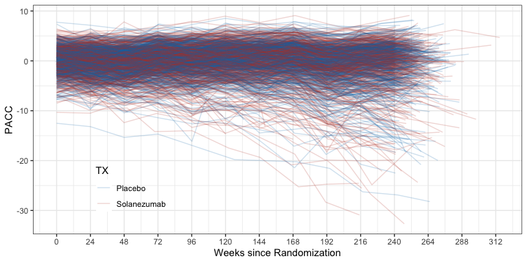
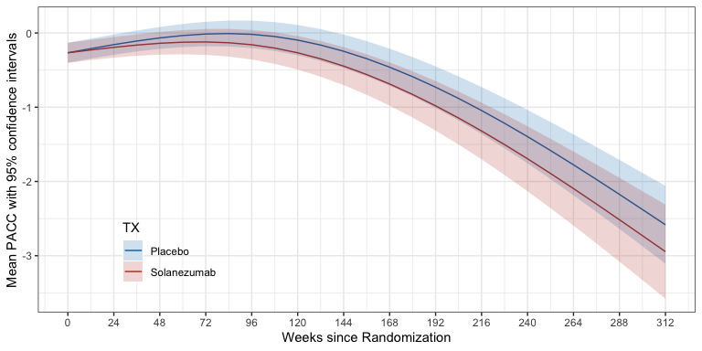

<!-- README.md is generated from README.Rmd. Please edit that file -->

# A4LEARN <a href="https://www.a4studydata.org/"></a>

## Overview

`A4LEARN` is an R package containing data and code to reproduce results
from the *Anti-Amyloid Treatment in Asymptomatic Alzheimer’s (A4)* study
(Sperling et al. 2023) and *Longitudinal Evaluation of Amyloid Risk and
Neurodegeneration (LEARN)* study (Sperling et al. 2024). `A4LEARN` is a
bundle of clinical data, analysis code examples, and html and pdf
documentation. Documentation can be found at
<https://atri-biostats.github.io/A4LEARN/>.

All data, including the `A4LEARN` R package, is available from either:

- <https://www.a4studydata.org/> after registering and agreeing to the
  [terms of use](https://www.a4studydata.org/terms-of-use).
- <https://www.synapse.org/a4_learn_datasharing/> after registering an
  account, fulfilling all actions from the ‘Access Actions Required’ tab
  of the [download cart](https://www.synapse.org/DownloadCart:0), and
  adding files to download.

## Installation

To install `A4LEARN`:

- Register at <https://www.a4studydata.org/> or
  <https://www.synapse.org/a4_learn_datasharing/>
- Download `A4LEARN_1.0.20241030.tar.gz` from the preferred data sharing
  platform
- In R, run
  `install.packages("path/to/A4LEARN_1.0.20241030.tar.gz", repos = NULL, type = "source")`

The script to build this R package can be found in
[tools](https://github.com/atrihub/A4LEARN/tree/main/tools).

# Reproducing A4 primary results

## Load required R packages

``` r
library(tidyverse)
library(arsenal)
library(kableExtra)
library(nlme)
library(emmeans)
library(splines)
library(clubSandwich)
library(A4LEARN)

formatp <- function(x) case_when(
  x < 0.001 ~ "p<0.001",
  x > 0.01 ~ Hmisc::format.pval(x, digits=2, eps=0.01, nsmall=2),
  TRUE ~ Hmisc::format.pval(x, digits=3, eps=0.001, nsmall=3))
```

## Organize data

``` r
# Outcomes collected at Visit 1
V1OUTCOME <- A4LEARN::ADQS %>%
  dplyr::filter(VISITCD == "001") %>%
  select(BID, QSTESTCD, QSSTRESN) %>%
  pivot_wider(values_from = QSSTRESN, names_from = QSTESTCD)

# Outcomes collected at Visit 6
V6OUTCOME <- A4LEARN::ADQS %>%
  dplyr::filter(VISITCD == "006") %>%
  select(BID, QSTESTCD, QSSTRESN) %>%
  pivot_wider(values_from = QSSTRESN, names_from = QSTESTCD)

SUBJINFO <- A4LEARN::SUBJINFO %>%
  left_join(V6OUTCOME, by = "BID") %>%
  left_join(V1OUTCOME %>%
      select(BID, CDRSB, CFITOTAL, CFISP, CFIPT, ADLPQPT, ADLPQSP), 
    by = "BID")

# Filter A4LEARN::ADQS for PACC collected in the blinded phases among mITT population
ADQS_PACC <- A4LEARN::ADQS %>%
  dplyr::filter(MITTFL== 1) %>%
  dplyr::filter(EPOCH == "BLINDED TREATMENT" | AVISIT == "006") %>%
  dplyr::filter(QSTESTCD == "PACC") %>%
  rename(PACC = QSSTRESN) %>%
  select(BID, ASEQNCS, TX, ADURW, TX, AGEYR, 
    AAPOEGNPRSNFLG, EDCCNTU, SUVRCER, QSVERSION, PACC) %>%
  mutate(TX = factor(TX, levels = c("Placebo", "Solanezumab"))) %>%
  na.omit()
```

## Baseline characteristics of the A4 trial

``` r
A4labels <- list(TX = "Treatment group", AGEYR = "Age (y)", 
  EDCCNTU = "Education (y)", SUVRCER = "FBP SUVr", AMYLCENT = "FBP Centiloid", 
  LMIIa = "LM Delayed Recall",  MMSE = "MMSE", 
  CFITOTAL = "CFI Combined", ADLPQSP = "ADL Partner", CDRSB = "CDR-SB",
  SEX = "Sex", RACE = "Racial categories", ETHNIC = "Ethnicity", 
  MARITAL = "Marital Status",  WRKRET = "Retirement Status", 
  APOEGNPRSNFLG = "APOE e4", APOEGN = "APOE Genotype")

table1 <- tableby(TX ~ AGEYR + EDCCNTU + SEX + RACE + ETHNIC + MARITAL + WRKRET + 
    SUVRCER + AMYLCENT + chisq(APOEGN) + chisq(APOEGNPRSNFLG) + 
    PACC + LMIIa + MMSE + CFITOTAL + ADLPQSP + CDRSB, 
  data = SUBJINFO %>% dplyr::filter(MITTFL== 1), 
  control = tableby.control(test=TRUE,
    stats.labels = list(Nmiss = "Missing")))

summary(table1, labelTranslations = A4labels, digits = 1,
  title = "Characteristics of the A4 participants by randomized treatment group (Modified Intention-to-Treat Population of those who received at least one dose of solanezumab or placebo and underwent assessment for the primary end point).")
```

|  | Placebo (N=583) | Solanezumab (N=564) | Total (N=1147) | p value |
|:---|:--:|:--:|:--:|---:|
| **Age (y)** |  |  |  | 0.923 |
|    Mean (SD) | 71.9 (5.0) | 72.0 (4.7) | 72.0 (4.8) |  |
|    Range | 65.0 - 85.7 | 65.0 - 85.5 | 65.0 - 85.7 |  |
| **Education (y)** |  |  |  | 0.785 |
|    Mean (SD) | 16.6 (2.9) | 16.6 (2.7) | 16.6 (2.8) |  |
|    Range | 8.0 - 30.0 | 7.0 - 30.0 | 7.0 - 30.0 |  |
| **Sex** |  |  |  | 0.481 |
|    Male | 231 (39.6%) | 235 (41.7%) | 466 (40.6%) |  |
|    Female | 352 (60.4%) | 329 (58.3%) | 681 (59.4%) |  |
| **Racial categories** |  |  |  | 0.831 |
|    American Indian or Alaskan Native | 0 (0.0%) | 1 (0.2%) | 1 (0.1%) |  |
|    Asian | 13 (2.2%) | 11 (2.0%) | 24 (2.1%) |  |
|    Black or African American | 15 (2.6%) | 12 (2.1%) | 27 (2.4%) |  |
|    More than one race | 3 (0.5%) | 5 (0.9%) | 8 (0.7%) |  |
|    Unknown or Not Reported | 3 (0.5%) | 4 (0.7%) | 7 (0.6%) |  |
|    White | 549 (94.2%) | 531 (94.1%) | 1080 (94.2%) |  |
| **Ethnicity** |  |  |  | 0.910 |
|    Hispanic or Latino | 18 (3.1%) | 16 (2.8%) | 34 (3.0%) |  |
|    Not Hispanic or Latino | 560 (96.1%) | 542 (96.1%) | 1102 (96.1%) |  |
|    Unknown or Not reported | 5 (0.9%) | 6 (1.1%) | 11 (1.0%) |  |
| **Marital Status** |  |  |  | 0.208 |
|    Divorced | 80 (13.7%) | 89 (15.8%) | 169 (14.7%) |  |
|    Married | 415 (71.2%) | 405 (71.8%) | 820 (71.5%) |  |
|    Never married | 26 (4.5%) | 14 (2.5%) | 40 (3.5%) |  |
|    Unknown or Not Reported | 12 (2.1%) | 6 (1.1%) | 18 (1.6%) |  |
|    Widowed | 50 (8.6%) | 50 (8.9%) | 100 (8.7%) |  |
| **Retirement Status** |  |  |  | 0.722 |
|    No | 142 (24.4%) | 126 (22.3%) | 268 (23.4%) |  |
|    Not Applicable | 9 (1.5%) | 9 (1.6%) | 18 (1.6%) |  |
|    Yes | 432 (74.1%) | 429 (76.1%) | 861 (75.1%) |  |
| **FBP SUVr** |  |  |  | 0.903 |
|    Mean (SD) | 1.3 (0.2) | 1.3 (0.2) | 1.3 (0.2) |  |
|    Range | 1.0 - 2.1 | 1.0 - 2.1 | 1.0 - 2.1 |  |
| **FBP Centiloid** |  |  |  | 0.903 |
|    Mean (SD) | 65.9 (32.1) | 66.2 (33.5) | 66.0 (32.8) |  |
|    Range | 0.3 - 205.4 | 0.3 - 201.7 | 0.3 - 205.4 |  |
| **APOE Genotype** |  |  |  | 0.624 |
|    E2/E2 | 0 (0.0%) | 1 (0.2%) | 1 (0.1%) |  |
|    E2/E3 | 33 (5.7%) | 28 (5.0%) | 61 (5.3%) |  |
|    E2/E4 | 22 (3.8%) | 13 (2.3%) | 35 (3.1%) |  |
|    E3/E3 | 208 (35.7%) | 202 (35.8%) | 410 (35.7%) |  |
|    E3/E4 | 273 (46.8%) | 273 (48.4%) | 546 (47.6%) |  |
|    E4/E4 | 47 (8.1%) | 47 (8.3%) | 94 (8.2%) |  |
| **APOE e4** |  |  |  | 0.896 |
|    No | 241 (41.3%) | 231 (41.0%) | 472 (41.2%) |  |
|    Yes | 342 (58.7%) | 333 (59.0%) | 675 (58.8%) |  |
| **PACC** |  |  |  | 0.831 |
|    Mean (SD) | -0.0 (2.6) | 0.0 (2.7) | 0.0 (2.7) |  |
|    Range | -12.5 - 7.8 | -10.3 - 6.4 | -12.5 - 7.8 |  |
| **LM Delayed Recall** |  |  |  | 0.757 |
|    Missing | 1 | 0 | 1 |  |
|    Mean (SD) | 12.7 (3.5) | 12.6 (3.8) | 12.6 (3.7) |  |
|    Range | 2.0 - 22.0 | 0.0 - 23.0 | 0.0 - 23.0 |  |
| **MMSE** |  |  |  | 0.763 |
|    Mean (SD) | 28.8 (1.2) | 28.8 (1.3) | 28.8 (1.3) |  |
|    Range | 24.0 - 30.0 | 22.0 - 30.0 | 22.0 - 30.0 |  |
| **CFI Combined** |  |  |  | 0.045 |
|    Missing | 2 | 0 | 2 |  |
|    Mean (SD) | 3.6 (3.3) | 4.0 (3.6) | 3.8 (3.5) |  |
|    Range | 0.0 - 20.0 | 0.0 - 22.0 | 0.0 - 22.0 |  |
| **ADL Partner** |  |  |  | 0.266 |
|    Mean (SD) | 43.5 (2.6) | 43.4 (2.7) | 43.4 (2.6) |  |
|    Range | 26.8 - 45.0 | 25.0 - 45.0 | 25.0 - 45.0 |  |
| **CDR-SB** |  |  |  | 0.154 |
|    Mean (SD) | 0.0 (0.2) | 0.1 (0.2) | 0.1 (0.2) |  |
|    Range | 0.0 - 2.0 | 0.0 - 1.0 | 0.0 - 2.0 |  |

Characteristics of the A4 participants by randomized treatment group
(Modified Intention-to-Treat Population of those who received at least
one dose of solanezumab or placebo and underwent assessment for the
primary end point).

## Primary analyis of the PACC

Preclinical Alzheimer Cognitive Composite (PACC, Donohue et al. (2014))
data was modeled using natural cubic splines as described in Donohue et
al. (2023). The fixed effects included the following terms: (i) spline
basis expansion terms (two terms), (ii) spline basis expansion
terms-by-treatment interaction (two terms), (iii) PACC test version
administered, (iv) baseline age, (v) education, (vi) APOE4 Carrier
Status (yes/no), and (vii) baseline florbetapir cortical SUVr. The model
is constrained to not allow a difference between treatment group means
at baseline. The following variance-covariance structures were assumed
in sequence until a model converged: (i) heterogeneous unstructured,
(ii) heterogeneous Toeplitz, (iii) heterogeneous autoregressive order 1,
(iv) heterogeneous compound symmetry, and (v) compound symmetry. The
first structure, heterogeneous unstructured, did not converge. Here we
fit the second, heterogeneous Toeplitz, which did converge.

``` r
ggplot(ADQS_PACC, aes(x=ADURW, y=PACC, color=TX)) +
  geom_line(aes(group = BID), alpha=0.2) +
  theme(legend.position = "inside", legend.position.inside = c(0.2, 0.2)) +
  xlab("Weeks since Randomization") +
  scale_x_continuous(breaks = seq(0, max(ADQS_PACC$ADURW), by = 24))
```

<div class="figure">


<p class="caption">
Spaghetti plot of PACC data over time by treatment group.
</p>

</div>

``` r
# Spline basis expansion functions
# CAUTION: these function depend on the ADQS_PACC data frame object in the 
# global environment. If ADQS_PACC changes, so do these funtions
ns21 <- function(t){
  as.numeric(predict(splines::ns(ADQS_PACC$ADURW, df=2,
    Boundary.knots = c(0, max(ADQS_PACC$ADURW))), t)[,1])
}
ns22 <- function(t){
  as.numeric(predict(splines::ns(ADQS_PACC$ADURW, df=2,
    Boundary.knots = c(0, max(ADQS_PACC$ADURW))), t)[,2])
}

assign("ns21", ns21, envir = .GlobalEnv)
assign("ns22", ns22, envir = .GlobalEnv)

# GLS model fit:
pacc_fit <- gls(PACC ~ 
    I(ns21(ADURW)) + I(ns22(ADURW)) +
    (I(ns21(ADURW)) + I(ns22(ADURW))):TX + 
    AGEYR + AAPOEGNPRSNFLG + EDCCNTU + SUVRCER + QSVERSION,
  data = ADQS_PACC,
  weights = varIdent(form = ~ 1 | ASEQNCS),
  correlation = corARMA(form = ~ ASEQNCS | BID, p = 10))
```

``` r
ref_grid(pacc_fit,
  at = list(ADURW = c(0,240), TX = levels(ADQS_PACC$TX)),
  vcov. = clubSandwich::vcovCR(pacc_fit, type = "CR2") %>% as.matrix(), 
  data = ADQS_PACC, 
  mode = "satterthwaite") %>%
  emmeans(~ ADURW | TX) %>%
  pairs(reverse = TRUE) %>%
  as_tibble() %>%
  mutate(p.value = formatp(p.value)) %>%
  kable(caption = "Mean PACC change from baseline at week 240 by treatment 
    group estimated from spline model.", digits = 2, booktabs = TRUE) %>%
  kableExtra::kable_styling(latex_options = "HOLD_position")
```

<table class="table" style="margin-left: auto; margin-right: auto;">
<caption>
Mean PACC change from baseline at week 240 by treatment group estimated
from spline model.
</caption>
<thead>
<tr>
<th style="text-align:left;">
contrast
</th>
<th style="text-align:left;">
TX
</th>
<th style="text-align:right;">
estimate
</th>
<th style="text-align:right;">
SE
</th>
<th style="text-align:right;">
df
</th>
<th style="text-align:right;">
t.ratio
</th>
<th style="text-align:left;">
p.value
</th>
</tr>
</thead>
<tbody>
<tr>
<td style="text-align:left;">
ADURW240 - ADURW0
</td>
<td style="text-align:left;">
Placebo
</td>
<td style="text-align:right;">
-1.13
</td>
<td style="text-align:right;">
0.16
</td>
<td style="text-align:right;">
10791
</td>
<td style="text-align:right;">
-6.88
</td>
<td style="text-align:left;">
p\<0.001
</td>
</tr>
<tr>
<td style="text-align:left;">
ADURW240 - ADURW0
</td>
<td style="text-align:left;">
Solanezumab
</td>
<td style="text-align:right;">
-1.43
</td>
<td style="text-align:right;">
0.21
</td>
<td style="text-align:right;">
10791
</td>
<td style="text-align:right;">
-6.95
</td>
<td style="text-align:left;">
p\<0.001
</td>
</tr>
</tbody>
</table>

``` r
contrast240 <- ref_grid(pacc_fit, 
  at = list(ADURW = 240, TX = levels(ADQS_PACC$TX)),
  vcov. = clubSandwich::vcovCR(pacc_fit, type = "CR2") %>% as.matrix(), 
  data = ADQS_PACC, 
  mode = "satterthwaite") %>%
  emmeans(specs = "TX", by = "ADURW") %>%
  pairs(reverse = TRUE, adjust = "none")

contrast240 %>% 
  as_tibble() %>%
  left_join(contrast240 %>% 
      confint() %>%
      as_tibble() %>%
      select(contrast, lower.CL, upper.CL), by="contrast") %>%
  relocate(p.value, .after = last_col()) %>%
  mutate(p.value = formatp(p.value)) %>%
  kable(caption = "Mean PACC group change from baseline at week 240 by treatment 
    group estimated from spline model.", digits = 2, booktabs = TRUE) %>%
  kableExtra::kable_styling(latex_options = "HOLD_position")
```

<table class="table" style="margin-left: auto; margin-right: auto;">
<caption>
Mean PACC group change from baseline at week 240 by treatment group
estimated from spline model.
</caption>
<thead>
<tr>
<th style="text-align:left;">
contrast
</th>
<th style="text-align:right;">
ADURW
</th>
<th style="text-align:right;">
estimate
</th>
<th style="text-align:right;">
SE
</th>
<th style="text-align:right;">
df
</th>
<th style="text-align:right;">
t.ratio
</th>
<th style="text-align:right;">
lower.CL
</th>
<th style="text-align:right;">
upper.CL
</th>
<th style="text-align:left;">
p.value
</th>
</tr>
</thead>
<tbody>
<tr>
<td style="text-align:left;">
Solanezumab - Placebo
</td>
<td style="text-align:right;">
240
</td>
<td style="text-align:right;">
-0.3
</td>
<td style="text-align:right;">
0.26
</td>
<td style="text-align:right;">
10791
</td>
<td style="text-align:right;">
-1.13
</td>
<td style="text-align:right;">
-0.82
</td>
<td style="text-align:right;">
0.22
</td>
<td style="text-align:left;">
0.26
</td>
</tr>
</tbody>
</table>

``` r
ref_grid(pacc_fit, 
  at = list(ADURW = seq(0, 312, by=12), TX = levels(ADQS_PACC$TX)),
  vcov. = clubSandwich::vcovCR(pacc_fit, type = "CR2") %>% as.matrix(), 
  data = ADQS_PACC, 
  mode = "satterthwaite") %>%
  emmeans(specs = "TX", by = "ADURW") %>%
  as_tibble() %>%
  ggplot(aes(x=ADURW, y=emmean)) +
  geom_line(aes(color=TX)) +
  geom_ribbon(aes(ymin = lower.CL, ymax = upper.CL, fill = TX), alpha = 0.2) +
  scale_x_continuous(breaks = seq(0, 312, by=24)) +
  ylab("Mean PACC with 95% confidence intervals") +
  xlab("Weeks since Randomization") +
  theme(legend.position = 'inside', legend.position.inside = c(0.2, 0.2))
```

<div class="figure">


<p class="caption">
Mean PACC per treatment group over time as estimated by spline model.
Shaded region depicts 95% confidence intervals.
</p>

</div>

## References

<div id="refs" class="references csl-bib-body hanging-indent"
entry-spacing="0">

<div id="ref-donohue2023natural" class="csl-entry">

Donohue, Michael C, Oliver Langford, Philip S Insel, Christopher H van
Dyck, Ronald C Petersen, Suzanne Craft, Gopalan Sethuraman, Rema Raman,
Paul S Aisen, and Alzheimer’s Disease Neuroimaging Initiative. 2023.
“Natural Cubic Splines for the Analysis of Alzheimer’s Clinical Trials.”
*Pharmaceutical Statistics*. <https://doi.org/10.1002/pst.2285>.

</div>

<div id="ref-donohue2014preclinical" class="csl-entry">

Donohue, Michael C, Reisa A Sperling, David P Salmon, Dorene M Rentz,
Rema Raman, Ronald G Thomas, Michael Weiner, Paul S Aisen, et al. 2014.
“The Preclinical Alzheimer Cognitive Composite: Measuring
Amyloid-Related Decline.” *JAMA Neurology* 71 (8): 961–70.
<https://doi.org/10.1001/jamaneurol.2014.803>.

</div>

<div id="ref-sperling2024amyloid" class="csl-entry">

Sperling, Reisa A, MC Donohue, RA Rissman, KA Johnson, DM Rentz, JD
Grill, JL Heidebrink, et al. 2024. “Amyloid and Tau Prediction of
Cognitive and Functional Decline in Unimpaired Older Individuals:
Longitudinal Data from the A4 and LEARN Studies.” *The Journal of
Prevention of Alzheimer’s Disease* 11 (4): 802–13.
<https://doi.org/10.14283/jpad.2024.122>.

</div>

<div id="ref-sperling2023trial" class="csl-entry">

Sperling, Reisa A, Michael C Donohue, Rema Raman, Michael S Rafii, Keith
Johnson, Colin L Masters, Christopher H van Dyck, et al. 2023. “Trial of
Solanezumab in Preclinical Alzheimer’s Disease.” *New England Journal of
Medicine* 389 (12): 1096–1107. <https://doi.org/10.1056/NEJMoa2305032>.

</div>

</div>
