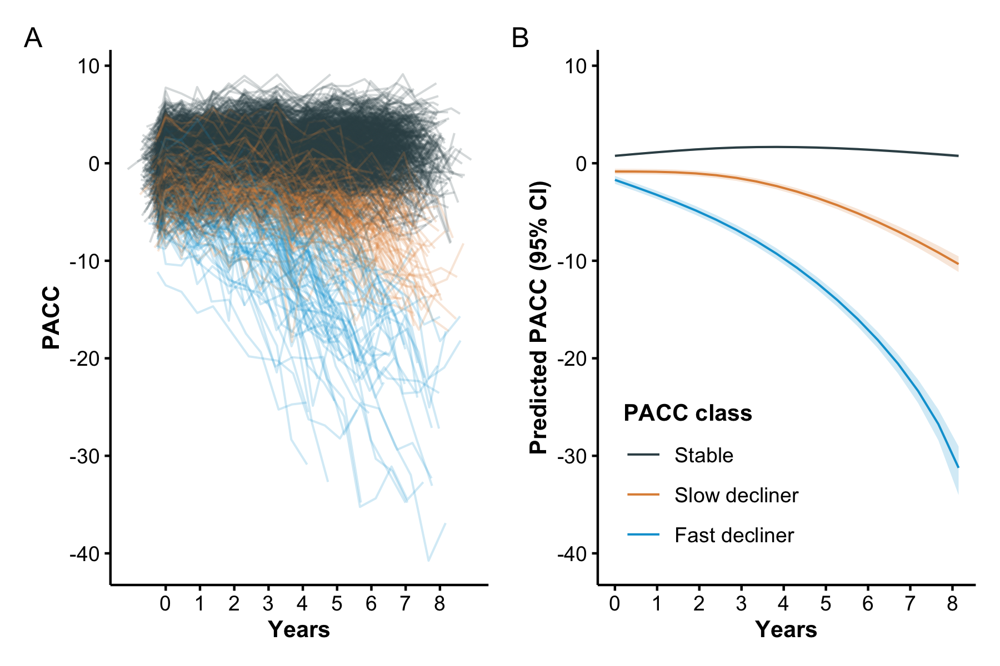
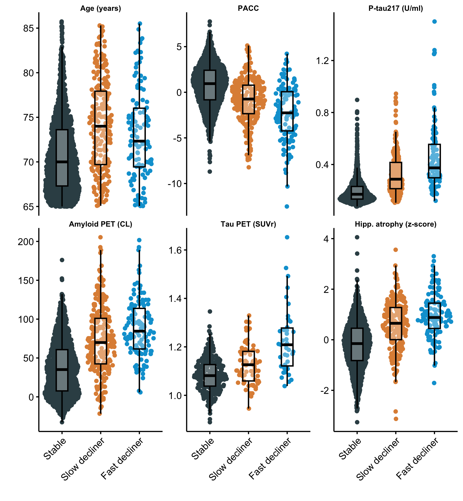
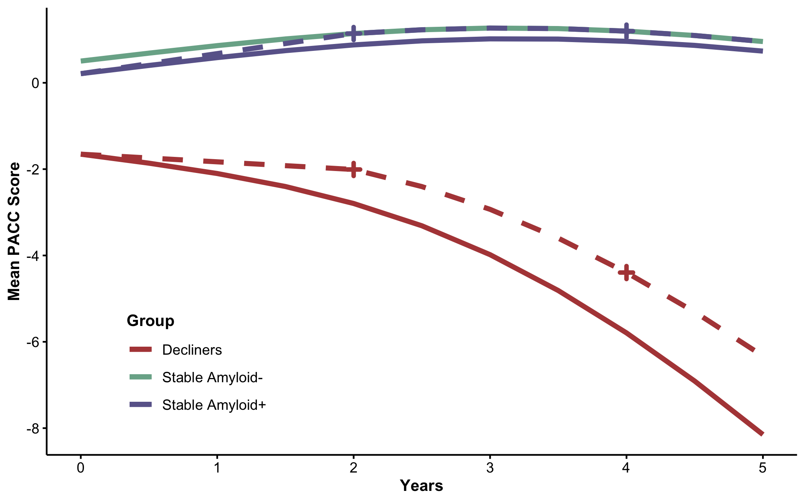
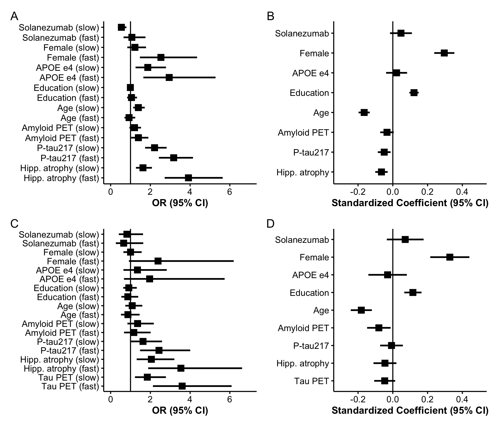
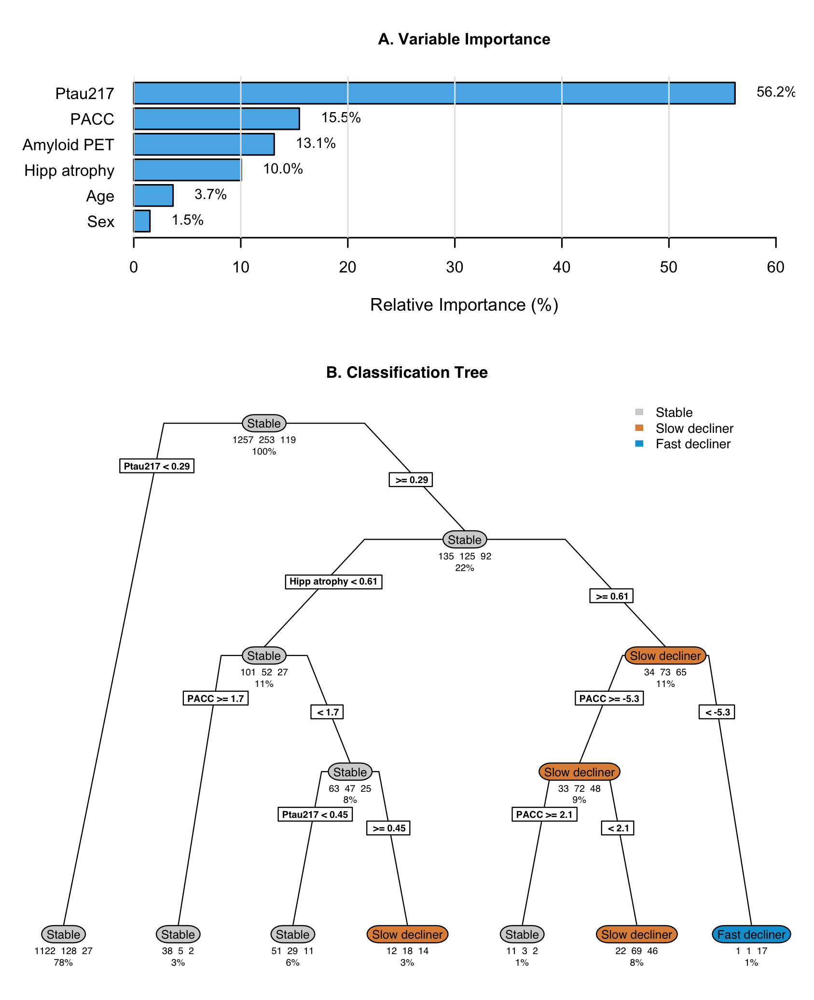
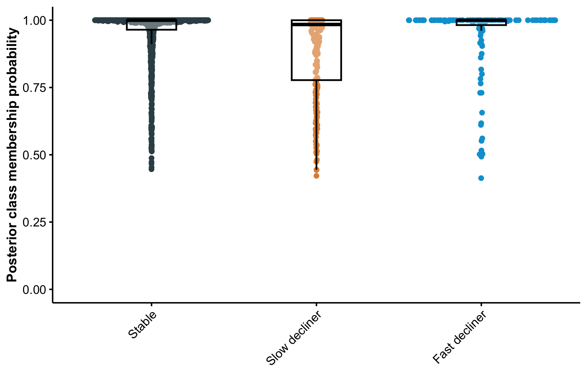
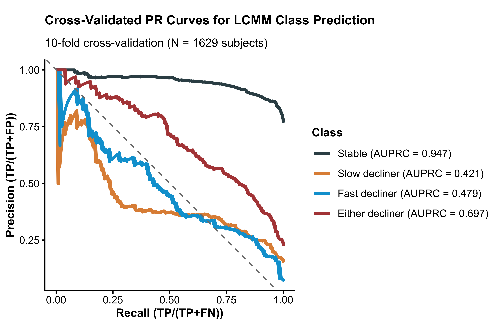
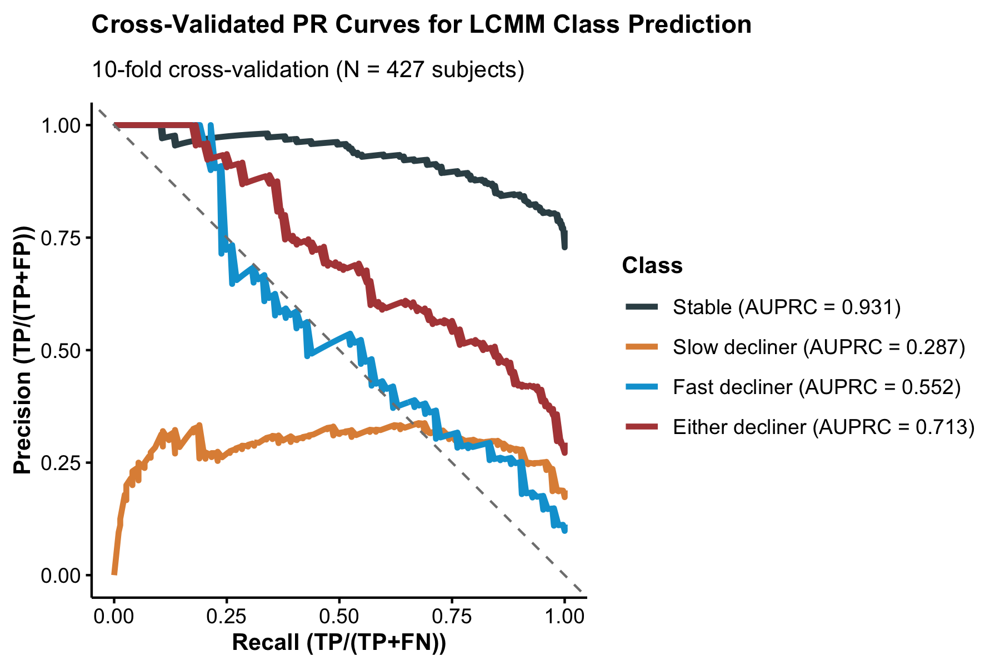
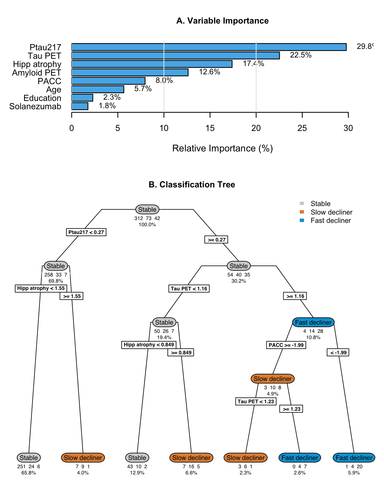

# Divergent patterns of cognitive decline in preclinical Alzheimer’s disease: implications for secondary prevention trials

## Research in Context

**Evidence before this study** We searched PubMed, MEDLINE, and Google
Scholar for articles published between January 1, 2000, and December 31,
2025, using the terms “preclinical Alzheimer’s disease,” “cognitive
decline,” and “latent class.” Previous studies have identified patterns
of cognitive decline in aging populations, but there is limited
understanding of the predictive value of recently developed biomarkers
of Alzheimer’s pathology, and we found no studies examining the impact
on secondary prevention trial design.

**Added value of this study** This study is the first to apply latent
class analysis to data from the A4 and LEARN studies, identifying
distinct classes of cognitive decline in individuals at risk for
Alzheimer’s disease. Our findings reveal significant heterogeneity in
cognitive trajectories, suggesting that preclinical Alzheimer’s disease
is not a uniform process. These insights could inform personalized
intervention strategies and improve the design of future clinical
trials.

**Implications of all the available evidence** Our results underscore
the importance of considering individual variability in cognitive
decline when developing and testing interventions for preclinical
Alzheimer’s disease. Recognizing the diverse patterns of cognitive
decline can enhance the precision of clinical trial designs and lead to
more effective, tailored therapeutic approaches. Future research should
focus on validating these findings in larger, more diverse cohorts and
exploring the underlying mechanisms driving the observed heterogeneity.

## Introduction

Elevated levels of brain amyloid in cognitively unimpaired older adults
are associated with subsequent cognitive decline and increased risk of
clinical
progression.^([1](#ref-petersen2016association)–[5](#ref-Sperling2024))
The Anti-Amyloid Treatment in Asymptomatic Alzheimer’s Disease (A4)
Study, a randomized trial of solanezumab in cognitively normal
individuals with elevated amyloid PET, demonstrated group-level decline
on a cognitive composite but no treatment
benefit.^([2](#ref-Sperling2023)) Follow-up analyses from A4 and its
companion observational study of amyloid-negative individuals, the
Longitudinal Evaluation of Amyloid Risk and Neurodegeneration (LEARN),
further confirmed that higher baseline amyloid PET and plasma
phosphorylated tau (P‐tau217) levels are associated with faster
cognitive decline and increased functional
progression.^([5](#ref-Sperling2024))

Despite these consistent group-level associations, cognitive
trajectories among amyloid-positive individuals remain highly variable.
Conventional longitudinal models assume that individual cognitive
trajectories are randomly scattered about a single mean trend for given
covariate values, potentially obscuring meaningful heterogeneity. To
better characterize this heterogeneity, we applied a Latent Class
Mixed-Effects Model (LCMM)^([6](#ref-proust2017estimation)) to A4 and
LEARN data. This approach identifies unobserved subgroups of
participants with distinct longitudinal patterns of change and allows
for evaluation of baseline biomarkers and demographic factors as
predictors of class membership.

Latent class growth model approaches have been applied several times in
the literature to identify distinct classes of late-life cognitive
trajectories. A systematic review by Wu et
al.^([7](#ref-wu2020distinct)) identified 37 investigations and these
consistently identified three classes: stable, slow decline, and fast
decline. However, many of these papers lacked more recently developed
biomarkers of Alzheimer’s pathology. One exception is the study by
Teipel et al.^([8](#ref-teipel2018effect)) included amyloid PET as a
predictor in a cohort of $`N=265`$ individuals followed for two years.
Villeneuve et al.^([9](#ref-VILLENEUVE2019553)) identified latent
classes of Amsterdam Instrumental-Activities-of-Daily-Living
questionnaire using amyloid PET and FDG PET in N=289 participants over
three years. Here, we consider latent classes of cognition predicted by
APOE genotype, amyloid PET, P‐tau217, hippocampal atrophy, and tau PET
in a cohort of $`N=1,629`$ individuals followed for up to seven years in
A4 and LEARN. Furthermore, we explore practical implications for
classification algorithms and clinical trials.

## Methods

### Conduct of the A4 and LEARN Studies

The A4 and LEARN studies have been previously
described^([2](#ref-Sperling2023),[5](#ref-Sperling2024)), but we
briefly summarize key elements. The A4 Study was a multicenter,
randomized, double-blind, placebo-controlled secondary prevention trial
enrolling cognitively unimpaired older adults aged 65–85 years with
elevated brain amyloid on florbetapir PET. Participants were recruited
from 67 sites in the United States, Canada, Australia, and Japan and
underwent standardized screening, baseline clinical assessment,
biomarker acquisition, and neuropsychological testing. After eligibility
confirmation, participants were randomized to receive solanezumab or
placebo and were assessed longitudinally with regular cognitive
evaluations, safety monitoring, and follow-up imaging and fluid
biomarker collection per protocol.

The LEARN study was conducted in parallel as an observational cohort
enrolling individuals who met all A4 screening criteria except for
amyloid PET positivity. LEARN participants completed identical clinical
and cognitive assessments, allowing direct comparison of trajectories
between amyloid-positive and amyloid-negative individuals. Both studies
followed harmonized procedures for data collection, visit scheduling,
and quality control to ensure comparability of longitudinal outcomes.

All participants of both studies provided written informed consent, and
study protocols were approved by the institutional review boards or
ethics committees at each participating site.

### Statistical Analysis

#### Latent Class Mixed-Effects Models

Latent class mixed-effects models (LCMMs) extend traditional
mixed-effects models by identifying unobserved subgroups, or latent
classes, of individuals who follow distinct longitudinal trajectories.
In the context of cognitive decline in Alzheimer’s disease, LCMMs allow
for the estimation of population-level trends while capturing individual
variability and uncovering hidden subpopulations that may progress at
different rates.

Analyses were conducted using harmonized data from the A4 and LEARN
studies, accessed through the `A4LEARN` R data package (version
1.1.20250808^([10](#ref-a4studydata),[11](#ref-donohue2025alzheimer))).
This package provides curated datasets and metadata derived from the A4
and LEARN clinical studies for reproducible statistical analysis. Code
to reproduce the results from this paper are available from the
`A4LEARN` GitHub repository^([12](#ref-a4learn_vignettes)).

The dependent variable was the Box-Cox-transformed Preclinical Alzheimer
Cognitive Composite (PACC)^([13](#ref-Donohue2014)) score at each visit.
The Box-Cox transformation parameter ($`\lambda`$) was selected to
maximize the likelihood that the transformed data approximated
normality. Time was modeled as a continuous variable representing years
since baseline.

Natural cubic spline basis functions with one, two or three degrees of
freedom were evaluated to model nonlinear trajectories, with boundary
knots at baseline and the maximum follow-up time and an interior knots
at the median or tertiles of observation time. The choice of degrees of
freedom and the number of classes (also one, two, or three) was
determined by model fit criteria (Bayesian Information Criterion \[BIC\]
and Integrated Complete Likelihood
\[ICL\]).^([14](#ref-biernacki2002assessing)) Each model included
class-specific spline-based time effects, as well as subject-specific
random intercepts. The effect of baseline covariates were shared across
latent classes and included: randomized to solanezumab (1 for the active
group, 0 for placebo or LEARN), plasma P-tau217 concentration,
florbetapir cortical standardized uptake value ratio (SUVr), APOE
$`\epsilon 4`$ carrier status, sex, age, education, hippocampal atrophy,
and PACC test stimulus version administered (which alternated per study
protocol). Plasma P-tau217 concentrations were measured using an
immunoassay developed by Eli Lilly and reported in arbitrary units per
milliliter (U/mL), where “U” denotes a generic assay unit proportional
to signal intensity. Absolute calibration against mass concentration
(e.g., pg/mL) was not available. Hippocampal atrophy measures were
derived by first residualizing with respect to intracranial volume, and
then standardizing to mean zero and variance one (i.e. z-scoring).

The LCMM includes two linked submodels. The longitudinal submodel
captures within-class trajectories of cognitive change over time. Each
class had its own set of spline coefficients, allowing class-specific
shapes of decline. The class membership submodel defines the probability
of belonging to each latent class as a multinomial logistic function of
baseline covariates (which includes all covariates listed above except
spline terms and PACC test version).

In a secondary analysis, we fit the model to the subset of participants
with baseline flortaucipir (tau) PET imaging. Tau PET was summarized as
the mean SUVr across eight cortical regions: entorhinal cortex, inferior
temporal, inferior parietal, posterior cingulate, caudal middle frontal,
middle temporal, superior parietal, and frontal pole. This composite
measure was included as an additional covariate in both the longitudinal
and class membership submodels to assess whether tau pathology improved
prediction of cognitive decline patterns or latent class assignment.

To assess the reliability and potential predictive utility of the latent
class membership model, we examined the posterior probabilities of class
assignment for each participant. High posterior probabilities indicate
greater certainty in latent class classification. We summarized these
distributions across classes and computed the mean posterior probability
within each group as an index of classification confidence.

#### Power Analysis for Latent Class-Specific Trials

To explore the impact of heterogeneity on clinical trials in preclinical
Alzheimer’s disease, we conducted power calculations to estimate power
for hypothetical trials targeting latent classes of cognitive decline
among amyloid-positive participants. Effect size estimates were derived
from longitudinal models using natural cubic splines applied to
Preclinical Alzheimer Cognitive Composite (PACC)
scores.^([15](#ref-donohue2023natural)) Separate models were fit for (a)
the stable class, (b) the decliner classes, and (c) a reference group of
amyloid-negative stable individuals. The models included fixed effects
for time (two degrees of freedom), APOE $`\epsilon 4`$ carrier status,
sex, age, education, plasma P-tau217, and florbetapir PET. Residuals
were assumed to be normally distributed with an unstructured covariance
matrix.

For each group, we extracted mean PACC and residual variance from the
model at two time points: 2 years and 4 years, representing potential
trial durations. These estimates were used to compute the power to
detect treatment effects. Power was approximated using two-sample t-test
calculations, assuming 500 participants per arm, attrition rates of 10%
at 2 years and 20% at 4 years, and a two-sided alpha of 0.05.

#### Ten-fold cross-validation of latent class predictions

To further evaluate prospective discrimination, we performed ten-fold
cross-validation stratified by P-tau217 and latent class. For each of
the ten folds, 90% of the data were used to re-train the LCMM, and the
re-trained model was used to predict latent classes for the 10% held-out
test set using only baseline data. Model performance was summarized
using the area under the precision-recall curve (AUPRC) for
discrimination of each class versus all others. This approach can be
more informative than receiver operating characteristic (ROC) curves
when group sizes are imbalance.^([16](#ref-saito2015precision))

#### Regression Tree Analysis for Latent Class Characterization

To evaluate whether latent classes could be distinguished by baseline
characteristics through a combination of binary decision rules, we
conducted a post-hoc classification tree
analysis^([17](#ref-rpart),[18](#ref-breiman2017classification)). Class
assignments from the optimal latent class mixed model were used as the
outcome variable, with baseline demographic and clinical characteristics
as predictors (randomized to solanezumab, plasma P-tau217 concentration,
florbetapir PET, APOE $`\epsilon 4`$ carrier status, sex, age,
education, hippocampal atrophy, and PACC). We separately considered a
regression tree with tau PET as an additional predictor.

Hyperparameter tuning was performed using 10-fold cross-validation. The
optimal hyperparameters were selected based on maximum cross-validated
accuracy. The final tree structure was visualized to illustrate the
hierarchy of decision rules for class assignment. Variable importance
was calculated based on the total reduction in node impurity attributed
to splits on each predictor. This approach provides an interpretable
framework for understanding the multivariate profile of each latent
class and assessing whether classes can be reliably separated using
clinically available baseline information.

All analyses were conducted using R (version 4.5.2; R Foundation for
Statistical Computing) with the `lcmm` package (version 2.2.1).

## Results

### Study Participants

A total of $`N=1,629`$ participants were included in the analytic sample
for the base model (without tau PET), comprising $`N=1,110`$ from the A4
Study and $`N=519`$ from the LEARN study. The mean (standard deviation
\[SD\]) age at baseline was 71.46 (4.69) years, and 60.2% were female.
The median follow-up time was 6.0 years (interquartile range 3.9 to
7.0). Baseline characteristics stratified by latent class membership are
presented in [Table 1](#tbl-baseline-base-characteristics). A total of
$`N=427`$ individuals had tau PET data and were submitted to the tau PET
model. The tau PET subset included $`N=372`$ from the A4 Study and
$`N=55`$ from the LEARN study. Baseline characteristics for the tau PET
subset are presented in [Supplementary Table
S1](#supptbl-baseline-tau-characteristics).

|  | Stable (N=1257) | Slow decliner (N=253) | Fast decliner (N=119) | Total (N=1629) | p value |
|:---|:---|:---|:---|:---|:---|
| Group |  |  |  |  | \< 0.001 |
| \- LEARN | 481 (38.3%) | 35 (13.8%) | 3 (2.5%) | 519 (31.9%) |  |
| \- Placebo | 386 (30.7%) | 128 (50.6%) | 49 (41.2%) | 563 (34.6%) |  |
| \- Solanezumab | 390 (31.0%) | 90 (35.6%) | 67 (56.3%) | 547 (33.6%) |  |
| Age, mean (SD), y | 70.78 (4.29) | 74.06 (5.24) | 73.10 (5.12) | 71.46 (4.69) | \< 0.001 |
| Sex, No. (%) |  |  |  |  | 0.016 |
| \- Male | 494 (39.3%) | 117 (46.2%) | 37 (31.1%) | 648 (39.8%) |  |
| \- Female | 763 (60.7%) | 136 (53.8%) | 82 (68.9%) | 981 (60.2%) |  |
| Race, No. (%) |  |  |  |  | 0.773 |
| \- N missing | 10 | 2 | 1 | 13 |  |
| \- Am. Indian or Alaska Native | 6 (0.5%) | 0 (0.0%) | 1 (0.8%) | 7 (0.4%) |  |
| \- Asian | 25 (2.0%) | 4 (1.6%) | 4 (3.4%) | 33 (2.0%) |  |
| \- Native Hawaiian or Other PI | 0 (0.0%) | 0 (0.0%) | 0 (0.0%) | 0 (0.0%) |  |
| \- Black or African Am. | 30 (2.4%) | 6 (2.4%) | 1 (0.8%) | 37 (2.3%) |  |
| \- White | 1179 (94.5%) | 240 (95.6%) | 112 (94.9%) | 1531 (94.7%) |  |
| \- Unknown or Not Reported | 7 (0.6%) | 1 (0.4%) | 0 (0.0%) | 8 (0.5%) |  |
| Ethnicity, No. (%) |  |  |  |  | 0.535 |
| \- Hispanic or Latino | 35 (2.8%) | 8 (3.2%) | 5 (4.2%) | 48 (2.9%) |  |
| \- Not Hispanic or Latino | 1211 (96.3%) | 241 (95.3%) | 114 (95.8%) | 1566 (96.1%) |  |
| \- Unknown or Not reported | 11 (0.9%) | 4 (1.6%) | 0 (0.0%) | 15 (0.9%) |  |
| Education, mean (SD), y | 16.62 (2.74) | 16.58 (2.70) | 16.32 (2.85) | 16.59 (2.74) | 0.512 |
| APOEε4, No. (%) |  |  |  |  | \< 0.001 |
| \- non-carrier | 732 (58.2%) | 93 (36.8%) | 31 (26.1%) | 856 (52.5%) |  |
| \- carrier | 525 (41.8%) | 160 (63.2%) | 88 (73.9%) | 773 (47.5%) |  |
| PACC, mean (SD) | 0.74 (2.37) | -0.90 (2.47) | -2.23 (3.10) | 0.27 (2.61) | \< 0.001 |
| Amyloid PET, mean (SD), CL | 37.40 (34.81) | 72.10 (42.88) | 88.62 (37.75) | 46.53 (40.23) | \< 0.001 |
| P-tau217, mean (SD), U/ml | 0.20 (0.09) | 0.33 (0.16) | 0.45 (0.26) | 0.24 (0.15) | \< 0.001 |
| Hipp. atrophy, mean (SD), z-score | -0.20 (0.96) | 0.60 (0.96) | 0.95 (0.87) | 0.01 (1.03) | \< 0.001 |
| Tau PET, mean (SD), SUVr |  |  |  |  | \< 0.001 |
| \- N missing | 946 | 179 | 77 | 1202 |  |
| \- Mean (SD) | 1.08 (0.07) | 1.13 (0.08) | 1.23 (0.13) | 1.10 (0.09) |  |
| CDR Prog., No. (%) |  |  |  |  | \< 0.001 |
| \- CDR Non-progressor | 970 (77.2%) | 71 (28.1%) | 14 (11.8%) | 1055 (64.8%) |  |
| \- CDR Progressor | 287 (22.8%) | 182 (71.9%) | 105 (88.2%) | 574 (35.2%) |  |

Table 1: **Baseline Demographic, Clinical, and Biomarker Characteristics
by Latent Class of Cognitive Decline.** Baseline characteristics of
participants classified by the latent class mixed model (LCMM) of
Preclinical Alzheimer Cognitive Composite (PACC) trajectories. Classes
represent distinct longitudinal cognitive patterns: stable, slow
decliner, and fast decliner. Continuous variables are presented as mean
(SD); categorical variables as No. (%). **Abbreviations:** APOE =
apolipoprotein E; PET = positron emission tomography; P-tau217 = plasma
phosphorylated tau 217; SUVr = standardized uptake value ratio; U/mL =
arbitrary units proportional to assay signal; Am. = American; PI =
Pacific Islander; CDR = Clinical Dementia Rating; Prog. = Progressor.
**Footnotes:** Amyloid PET and tau PET SUVr values represent mean
cortical uptake relative to cerebellar reference region. Hippocampal
atrophy are residualized for intracranial volume and z-scored. Education
reported in years of formal schooling. CDR Progressors were observed to
have a CDR Global score greater than zero at two consecutive visits, or
their last visit.

### Characterization and Prediction of Latent Classes

Figure 1: **Individual and mean PACC trajectories by latent class.**
Left panel (A): Spaghetti plot of individual participant trajectories on
the Preclinical Alzheimer Cognitive Composite (PACC), colored by latent
class derived from the latent class mixed model (LCMM). Each line
represents one participant’s observed scores over time. Right panel (B):
Estimated mean PACC trajectories for each latent class, with shaded
regions indicating 95% confidence intervals. Higher PACC scores indicate
better cognitive performance.

Figure 2: **Distribution of baseline demographic and biomarker variables
by latent class of cognitive decline.** Sina plots show the distribution
of selected baseline variables among latent classes identified by the
latent class mixed model (LCMM) of Preclinical Alzheimer Cognitive
Composite (PACC) trajectories: stable, slow decliner, and fast decliner.
Variables include age, baseline PACC score, plasma phosphorylated tau
217 (P-tau217), amyloid positron emission tomography (PET) standardized
uptake value ratio (SUVr), tau PET SUVr (subset with tau PET available),
and hippocampal atrophy (volume normalized to intracranial volume). Each
dot represents an individual participant; box plots represent quartiles.
Higher PACC scores indicate better cognitive performance.
**Abbreviations:** PET = positron emission tomography; P-tau217 = plasma
phosphorylated tau 217; SUVr = standardized uptake value ratio; U/mL =
arbitrary units proportional to assay signal.

Individual and base LCMM (excluding Tau PET) mean trajectories are shown
in [Figure 1](#fig-long-spaghetti-pacc-mri). Model selection criteria
identified the model with two degrees of freedom and three latent
classes, which we labeled as stable (77%), slow decliner (16%), and fast
decliner (7%). The next best fitting model had three classes and three
degrees of freedom ($`\Delta`$ BIC = 22.2, $`\Delta`$ ICL = 22.2). The
best fitting Tau PET LCMM had two degrees of freedom and three latent
classes ([Supplementary Figure
S3](#suppfig-long-spaghetti-pacc-tau-pet)) and the next best fitting
model had two classes and two degrees of freedom ($`\Delta`$ BIC =
376.4, $`\Delta`$ ICL = 336.9). The two models largely agreed on
individual classifications. Only 7/427 (1.6%) individuals were
reclassified from one model to the next, and none of those were fast
decliners. Posterior class probabilities ([Supplementary Figure
S4](#suppfig-postprobs)) indicated good separation (mean posterior
probability, 0.94), indicating model confidence in class assignment.

The three classes are significantly separated starting immediately at
baseline. From the base model, participants classified as fast decliners
started with a mean -0.98 (95% confidence interval \[CI\] -1.44 to
-0.52) PACC points and declined to a mean of -15.8 (95% CI -16.7 to
-15.0) at six years. In contrast stable individuals started with a mean
0.52 (95% CI 0.37 to 0.67) PACC points and improved to a mean of 1.16
(95% CI 1.00 to 1.31) at six years. Slow decliners were intermediate
between the other two classes starting with a mean -0.13 (95% CI -0.44
to 0.17) PACC points and declining to a mean -4.74 (95% CI -5.22 to
-4.26).

Clinical relevance of the PACC latent classes was supported by
differences in functional outcomes. The proportion of participants who
were observed to progress on the Clinical Dementia Rating (CDR) Global
score increased monotonically across latent classes, with the lowest
rate among stable individuals (22.8%) and progressively higher rates
among slow- (71.9%) and fast-decliners (88.2%)
([Table 1](#tbl-baseline-base-characteristics)). However, discordance
between PACC latent class labels and observed CDR progression is common.
While CDR Global scores greater than zero are possible without an
indication of memory issues, this explains a very little of the
discordance. Among CDR progressors, the proportion of individuals with a
CDR Memory Box score of zero was 8.4% of PACC stable individuals, 5.5%
of slow decliners, and 4.8% of fast decliners.

The distribution of continuous baseline variables by latent class is
shown in [Figure 2](#fig-sina-baseline) and [Supplementary Figure
S1](#suppfig-lcmm-coefs) summarizes standardized coefficients and 95%
CIs from both components of the LCMM. [Supplementary Figure
S1](#suppfig-lcmm-coefs) Panels A and C depicts odds ratios (ORs) for
the class membership submodels from the base model and tau PET model.
Continuous predictors are standardized so that ORs reflect the change in
odds of belonging to the fast- or slow declining class compared with the
stable class per one SD increase in each continuous baseline predictor.

From the base model (Panel A), higher plasma P-tau217 levels (OR 3.2,
95% CI 2.4 to 4.1), elevated amyloid PET centiloid (OR 1.4, 95% CI 1.0
to 1.9), and greater hippocampal atrophy scores (OR 3.9, 95% CI 2.7 to
5.6) were each associated with increased odds of belonging to
faster-declining classes. Interestingly, P-tau217 and hippocampal
atrophy had numerically stronger effects than amyloid PET. Also of
interest, fast decliners were numerically younger (mean 73.1 years, SD
4.7), on average, than slow decliners (mean 74.1 years, SD 5.2) and
increased age was associated with membership in the slow declining group
(OR 1.4, 95% CI 1.1 to 1.7) but not the fast declining group (OR 0.93,
95% CI 0.69 to 1.2). Tau PET model results are largely similar, but
confidence intervals are wider, likely due to smaller available sample
($`N=427`$ vs $`N=1,629`$). Increased tau PET was associated with
increased odds of slow- (OR = 1.8, 95% CI 1.2 to 2.8) and fast-declining
groups (OR = 3.6, 95% CI 2.1 to 6.1).

[Supplementary Figure S1](#suppfig-lcmm-coefs) Panels B and D presents
standardized coefficients from the longitudinal submodels, representing
associations between each covariate and the PACC outcome. Higher PACC
scores correspond to better cognitive performance and continuous
variables are standardized and oriented so that positive coefficients
indicate better performance. We see that females had increased risk of
being fast decliners (OR 2.5, 95% CI 1.5 to 4.4), but had better PACC
performance for a given class membership (0.30 PACC points, 95% CI 0.24
to 0.35). APOE $`\epsilon 4`$ carriage was associated with increased
risk of both slow (OR 1.9, 95% CI 1.3 to 2.8) and fast (OR 2.9, 95% CI
1.6 to 5.3) declining class versus stable class, but negligible
remaining effect on PACC. Education had no effect on class membership,
but was associated with better PACC performance (0.12 PACC points per SD
of education, 95% CI 0.095 to 0.15).

### Power Analysis for Latent Class-Specific Trials

Figure 3: **Trends for latent class-specific clinical trials.** Mean
trajectories were estimated from longitudinal models using natural cubic
splines (two degrees of freedom) applied to Preclinical Alzheimer
Cognitive Composite (PACC) scores for (a) two decliner classes, (b)
amyloid-positive stable participants, and (c) a reference group of
amyloid-negative stable individuals representing the maximum possible
treatment benefit. For decliners, power calculations assume a treatment
effect equal to 20% of the maximum possible benefit at 2 and 4 years.
For amyloid-positive stable participants, power calculations assume a
treatment effect equal to 100% of the maximum possible benefit at 2 and
4 years. Dashed lines represent projected mean PACC scores under
treatment; crosses indicate time points used for power calculations.

Latent class-specific power analyses revealed marked differences in
cognitive trajectories and variability across classes (see
[Supplementary Table S2](#supptbl-clda-power)). The amyloid-negative
stable group had the highest mean (SD) PACC scores over time: +1.14
(2.11) at 2 years and +1.20 (2.25) at 4 years. We considered this the
maximum possible treatment benefit. The stable amyloid-positive group
had means of +0.88 (2.19) at 2 years and +0.96 (2.34) at 4 years. With
500 participants per arm, a trial in amyloid-positive stable individuals
would have only 44% power at 2 years and 30% at 4 years to detect even
100% of the maximum benefit (0.26 PACC points at 2 years and 0.24 at 4
years). In contrast, a trial in amyloid-positive declining individuals
would have 93% power at 2 years and 98% at 4 years to detect just 20% of
the maximum benefit (0.79 PACC points at 2 years and 1.40 at 4 years).

These findings suggest that stable amyloid-positive individuals,
although they may have the greatest potential long-term benefit from a
disease-modifying drug, contribute little to the statistical power of a
preclinical Alzheimer’s disease trial to detect an effect on the PACC.
Instead, power is primarily driven by declining individuals, who
represent a minority of the amyloid-positive population. Enrolling large
numbers of stable individuals may dilute the overall treatment effect
and reduce the trial’s ability to detect meaningful cognitive benefits.
These results underscore the need to account for latent classes of
decline when designing preclinical Alzheimer’s disease trials.

### Predictive Performance and Cross-Validation

The overall cross-validated accuracy was 0.80 (95% CI 0.79 to 0.82) for
the base model and 0.756 (95% CI 0.73 to 0.78) for the tau PET model.
However, this accuracy rate is inflated by the large number of stable
individuals (1,257/1,629 = 77.2%), which are relatively easy for the
model to identify. AUPRCs from the base model were 0.95, 0.41, and 0.49
for non-, slow-, and fast decliners versus the rest; and 0.70 for either
slow- or fast decliner vs stable ([Supplementary Figure
S5](#suppfig-cross-val-base-pr)). AUPRCs from the tau PET model were
0.92, 0.31, and 0.56 for non-, slow-, and fast decliners versus the
rest; and 0.71 for either slow- or fast decliner vs stable
([Supplementary Figure S6](#suppfig-cross-val-tau-pet-pr)).

### Post-hoc Regression Tree

The optimally-tuned classification tree without tau PET achieved a mean
balanced accuracy of 0.63 (standard error 0.007) in 10-fold
cross-validation ([Supplementary Figure S2](#suppfig-tree-base)).
Variable importance analysis identified baseline P-tau217 (56.2%),
baseline PACC (15.5%), amyloid PET (13.1%), and hippocampal atrophy
(10.0%) as most important; though amyloid PET was not included in the
tree, likely due to its correlation with P-tau217. The tree structure
revealed a hierarchical decision process with participants with baseline
P-tau217 \< 0.29 were classified as stable individuals, though this
miss-classifies $`N=155`$ decliners. Those with P-tau217 $`\geq`$ 0.29
are further parsed by hippocampal atrophy, PACC, and P-tau217. Only one
leaf contains a majority of fast decliners, and it contains only 1% of
the initial sample. While the tree demonstrates the relative importance
and utility of the predictors, it also demonstrates a high degree of
miss-classification (31.4%). Cross-validated balanced accuracy is
improved by the addition of tau PET (mean 0.69, standard error 0.02;
[Supplementary Figure S7](#suppfig-tree-tau-pet)). Tau PET has the
second largest variable importance (22.5%), between P-tau217 (29.8%) and
hippocampal atrophy (17.4%). The tree with tau PET results in a larger
proportion of leaves which are majority fast decliners (8.5% versus 1%
without tau PET).

### Longitudinal Biomarker Progression Across Latent Classes

To further characterize biological differences among the latent
trajectory groups, we compared longitudinal changes in amyloid PET,
plasma P-tau217, tau PET (medial temporal and neocortical), and
hippocampal volume across the four classes
([Figure 4](#fig-long-biomarkers)). As expected, slow and fast decliners
showed the most rapid biomarker progression across modalities,
consistent with their steeper cognitive decline. In contrast, Aβ– stable
individuals demonstrated minimal change over time in all biomarkers,
supporting their classification as biologically and clinically stable.
Notably, Aβ+ stable individuals, despite showing PACC trajectories that
closely resembled Aβ– stable individuals, exhibited clear evidence of
biomarker progression, including increasing amyloid burden, rising
plasma and PET tau signals, and accelerating hippocampal atrophy. These
findings suggest that many Aβ+ stable individuals may represent an
earlier stage of preclinical disease and could transition into declining
classes with extended follow-up, highlighting the temporal dissociation
between biomarker progression and short-term cognitive change.

Figure 4: **Longitudinal biomarker trajectories by PACC latent class.**
Each panel displays individual biomarker trajectories (light lines) and
the estimated mean trajectory (bold black line) from a linear
mixed-effects model with random slopes and natural cubic spline fixed
effects (2 degrees of freedom). Columns correspond to Aβ– stable, Aβ+
stable, slow decliner, and fast decliner. Rows represent five
longitudinal biomarkers: amyloid PET (Centiloids), plasma P-tau217
(U/mL), medial temporal lobe (MTL) tau PET SUVR, neocortical tau PET
SUVR, and hippocampal volume. While Aβ– and Aβ+ stable individuals
demonstrate similarly stable cognitive trajectories, the Aβ+ stable
individuals exhibit clear biomarker progression across amyloid, tau, and
neurodegeneration measures, suggesting that many may be in an earlier
stage of preclinical disease and could transition into declining classes
with longer follow-up.

## Discussion

In this latent class mixed-model analysis of cognitively unimpaired
older adults, we identified distinct trajectories of PACC performance
and evaluated the extent to which plasma and imaging biomarkers
prospectively distinguished individuals who remained cognitively stable
from those who showed slow or rapid decline. Several findings highlight
challenges for prognostic modeling in the preclinical stage of Alzheimer
disease and have direct implications for secondary prevention trial
design.

### Available Predictors Only Partially Discriminate Future Decline

Although plasma P-tau217 and amyloid PET were each associated with
latent class membership, neither biomarker alone, or in combination,
achieved high accuracy in predicting of cognitive decline. A key
observation was the high frequency of cognitive stability among
amyloid-positive participants. As shown in
[Table 1](#tbl-baseline-base-characteristics), 776 of 1,110
amyloid-positive A4 participants (69.9%) were classified as stable
individuals, indicating that substantial amyloid burden does not
necessarily translate into measurable cognitive change over the
timescales typical of prevention trials. However, this is consistent
with a pre-symptomatic phase of disease believed to last as long as 15
years.

Compared to the 30.1% of amyloid-positive individuals classified as
decliners, a small minority of amyloid-negative LEARN participants were
classified as decliners. Thirty-eight of 519 (7.3%) amyloid-negative
individuals were classified as slow or fast decliners, suggesting that
some causes of decline may reflect non–AD processes, early AD pathology
below PET detection thresholds at baseline that accumulated over the 5
year period, or cognitive measurement variability. These findings
reinforce that amyloid positivity, while necessary for defining the AD
pathophysiologic continuum, is an insufficient standalone predictor of
short- to intermediate-term cognitive decline.

### Relative Contributions of Plasma P-tau217 and Tau PET

Plasma P-tau217 demonstrated stronger prognostic associations than
amyloid PET, consistent with biomarker models positioning tau
abnormalities closer to symptom onset. This observation aligns with
prior reports, showing improved prognostic accuracy with plasma tau
markers.^([5](#ref-Sperling2024)) However, classification tree analyses
indicated that no single P-tau217 threshold meaningfully enriched for
decliners without simultaneously excluding many true decliners,
underscoring the limitations of threshold-based enrichment strategies.

Tau PET provided incremental predictive value beyond plasma P-tau217 and
amyloid PET, although gains were modest. Because tau PET captures
later-stage pathologic changes, these results are biologically
plausible. Nevertheless, the logistical and financial limitations of tau
PET constrain its feasibility as a routine screening tool in large-scale
prevention trials.

### Implications for Secondary Prevention Trial Design

**Participant Selection.** Because most amyloid-positive individuals
remain cognitively stable, eligibility based solely on amyloid
positivity will enroll many stable participants, reducing power for
cognitive endpoints. Plasma P-tau217 may improve enrichment but cannot
reliably isolate decliners. More complex multimodal strategies or
repeated biomarker assessments may be needed for adequate prognostic
discrimination.

**Designing Trials for Heterogeneous Cohorts.** Traditional power
calculations assume a homogeneous population and uniform treatment
effect size, overlooking substantial heterogeneity in cognitive
trajectories. Fast decliners may show larger measurable effects but
often represent individuals further along the disease continuum and
exhibit greater variability, while stable individuals pose a different
challenge. Their stability limits detectable cognitive benefit even if
biological effects occur, requiring treatments to produce gains beyond
natural improvement. Our analysis shows that variability across classes
directly influences minimum detectable effect sizes, meaning that
single-effect-size assumptions risk underpowered studies or inefficient
resource allocation. More realistic simulation-based approaches that
incorporate class-specific trajectories and differential treatment
effects can improve trial design by informing enrichment strategies,
optimizing sample sizes, and aligning outcomes with subgroup
trajectories.

**Added Value of Tau PET.** Tau PET provided additional predictive
information but its incremental value must be weighed against
feasibility. Tau-PET-based staging may help identify individuals closer
to clinical transition, though widespread implementation in prevention
trials remains challenging.

**Outcome Selection.** Limited cognitive change in stable individuals
raises questions about the sensitivity of traditional cognitive outcomes
at this early stage. Digital measures of learning curves and biological
endpoints such as plasma or tau PET may offer more responsive markers of
treatment effect and serve as secondary or exploratory outcomes. Given
evidence that tau PET correlates more strongly with cognitive decline
than amyloid biomarkers, longitudinal tau PET or plasma P-tau217 may be
useful for monitoring treatment response or detecting early trajectory
divergence. Future work applying latent class or trajectory models to
biomarker data may clarify whether biomarker-defined progressors can be
identified earlier or more reliably than cognitive progressors.

**Early Intervention.** Anti-amyloid therapies show greater benefit in
symptomatic individuals with less tau pathology, supporting the theory
that earlier intervention yields greater benefit. However, if
presymptomatic decline unfolds gradually over a decade or more, trials
starting early may struggle to demonstrate cognitive benefit within
feasible windows. Refining and validating sensitive digital and
biomarker-based endpoints will be essential for advancing preclinical
therapy development. Reliable measures of target engagement and disease
progression could improve enrichment, increase power, and enable
detection of treatment effects even among cognitively stable
participants.

### Overall Interpretation

In summary, data-driven cognitive trajectories among initially
unimpaired older adults exhibited substantial heterogeneity, and widely
used biomarkers, including plasma P-tau217 and amyloid PET, were only
partially effective in predicting who would decline over the time frame
of a prevention trial. These limitations highlight the need for improved
prognostic tools, potentially incorporating longitudinal biomarker
dynamics, multimodal risk models, or digital assessments. Until then,
secondary prevention trials must account for substantial heterogeneity
in cognitive trajectories when planning enrollment, power calculations,
trial simulations, and analytic strategies.

### Strengths and Limitations

This study has several strengths. We leveraged a large, deeply
phenotyped cohort of cognitively unimpaired older adults with
longitudinal cognitive assessments and harmonized biomarker data, using
the A4LEARN R package to standardize and reproducibly analyze data
across the A4 and LEARN cohorts. The latent class mixed-model approach
allowed us to identify data-driven cognitive trajectories rather than
relying on predefined thresholds or single-outcome definitions of
decline. The inclusion of plasma P-tau217, amyloid PET, and, within a
subset, tau PET enabled evaluation of multiple biomarkers spanning
distinct phases of Alzheimer disease pathophysiology.

This study also has limitations. First, although latent class methods
improve characterization of heterogeneity, class assignments are
probabilistic and sensitive to model specification. Second, follow-up
duration, while substantial, may still be insufficient to capture
long-term cognitive change among stable individuals. Third, tau PET was
available only in a subset, limiting statistical power for comparisons
involving this biomarker and potentially reducing generalizability.
Fourth, although we examined a broad panel of covariates, unmeasured
factors, including comorbidities, lifestyle variables, and
scanner-related differences, may influence both biomarker levels and
cognitive outcomes. Finally, this is highly selected sample of
individuals who were either eligible for the A4 study, or ineligible
owing only to low amyloid PET signal, and may not fully represent
community-dwelling older adults.

## Conclusions

Among cognitively unimpaired older adults, cognitive trajectories showed
marked heterogeneity, and widely used biomarkers, including plasma
P-tau217 and amyloid PET, were only partially effective in
distinguishing who would decline. Tau PET provided modest additional
predictive value but remains impractical for widespread enrichment.
These findings highlight the challenge of prospectively identifying
decliners in preclinical Alzheimer’s disease and underscore the need for
improved multimodal prognostic tools. Secondary prevention trials should
account for substantial heterogeneity in cognitive trajectories when
developing enrollment strategies, powering cognitive endpoints, and
interpreting treatment effects.

## Acknowledgements

The authors would like to thank the A4 and LEARN Study Teams and site
principal investigators and staff. Special gratitude to the A4 and LEARN
participants and their study partners, without whom these studies would
not be possible.

**Funding:** The A4 and LEARN Studies were supported by a
public-private-philanthropic partnership which included funding from the
National Institute of Aging of the National Institutes of Health (R01
AG063689, U19AG010483 and U24AG057437), Eli Lilly (also the supplier of
active medication and placebo), the Alzheimer’s Association, the
Accelerating Medicines Partnership through the Foundation for the
National Institutes of Health, the GHR Foundation, the Davis Alzheimer
Prevention Program, the Yugilbar Foundation, an anonymous foundation,
and additional private donors to Brigham and Women’s Hospital, with
in-kind support from Avid Radiopharmaceuticals, Cogstate, Albert
Einstein College of Medicine and the Foundation for Neurologic Diseases.
Other support was provided by grants from the Epstein Family Foundation.

**Conflict of Interest Disclosures:** Dr Aisen reported personal fees
from Merck, Biogen, Roche, AbbVie, ImmunoBrain Checkpoint, Bristol Myers
Squibb, and Neurimmune and grants from Eisai outside the submitted work.
Dr Sperling reported consulting fees from AbbVie, AC Immune, Acumen,
Alector, Apellis, Biohaven, Bristol Myers Squibb, Genentech, Janssen,
Nervgen, Oligomerixg, Prothena, Roche, Vigil Neuroscience, Ionis, and
Vaxxinity outside the submitted work. Dr Donohue reported personal fees
from Roche (consultant) and Janssen Pharmaceuticals (spouse is full-time
employee) outside the submitted work. Dr Raman reported grants from
American Heart Association, Gates Ventures, Eisai, Alzheimer’s
Association. No other disclosures were reported.

## Supplementary Material

Supplementary Figure S1: **Association of baseline predictors with
latent class membership and longitudinal cognitive decline in models
with and without tau PET.** Panels A and B display results from the
latent class mixed model (LCMM) excluding tau PET; panels C and D show
corresponding results from the model including tau PET as an additional
predictor. (A, C) Odds ratios (95% CIs) from the LCMM class-membership
submodel represent the relative likelihood of belonging to the slow- or
fast-declining classes relative to stable class. (B, D) Standardized
coefficients (95% CIs) from the LCMM longitudinal submodel show
associations between baseline predictors and rate of change in the
Preclinical Alzheimer Cognitive Composite (PACC). All continuous
predictors and the PACC outcome were standardized (z-scored) before
analysis to enable comparison of effect magnitudes. Higher PACC scores
indicate better cognitive performance; thus, larger positive
coefficients correspond to slower decline or better preservation of
cognition over time.

Supplementary Figure S2: **Classification tree analysis for latent class
assignment from Base Model.** Panel (A) shows relative importance of
baseline predictors for class separation. Panel (B) shows classification
tree showing binary decision rules for assigning subjects to latent
classes based on predictors. Terminal nodes show predicted class, number
of subjects, and percentage of total sample. The optimal tree complexity
was determined using 10-fold cross-validation with the 1-standard error
rule, resulting in a tree with 6 splits (mean balanced accuracy 0.63,
standard error 0.007).

|  | Stable (N=312) | Slow decliner (N=73) | Fast decliner (N=42) | Total (N=427) | p value |
|:---|:---|:---|:---|:---|:---|
| Group |  |  |  |  | 0.004 |
| \- LEARN | 52 (16.7%) | 3 (4.1%) | 0 (0.0%) | 55 (12.9%) |  |
| \- Placebo | 131 (42.0%) | 34 (46.6%) | 23 (54.8%) | 188 (44.0%) |  |
| \- Solanezumab | 129 (41.3%) | 36 (49.3%) | 19 (45.2%) | 184 (43.1%) |  |
| Age, mean (SD), y | 71.15 (4.51) | 73.74 (4.83) | 72.80 (5.65) | 71.76 (4.78) | \< 0.001 |
| Sex, No. (%) |  |  |  |  | 0.009 |
| \- Male | 126 (40.4%) | 40 (54.8%) | 11 (26.2%) | 177 (41.5%) |  |
| \- Female | 186 (59.6%) | 33 (45.2%) | 31 (73.8%) | 250 (58.5%) |  |
| Race, No. (%) |  |  |  |  | 0.426 |
| \- N missing | 3 | 0 | 1 | 4 |  |
| \- Am. Indian or Alaska Native | 1 (0.3%) | 0 (0.0%) | 0 (0.0%) | 1 (0.2%) |  |
| \- Asian | 12 (3.9%) | 2 (2.7%) | 4 (9.8%) | 18 (4.3%) |  |
| \- Native Hawaiian or Other PI | 0 (0.0%) | 0 (0.0%) | 0 (0.0%) | 0 (0.0%) |  |
| \- Black or African Am. | 7 (2.3%) | 4 (5.5%) | 0 (0.0%) | 11 (2.6%) |  |
| \- White | 287 (92.9%) | 67 (91.8%) | 37 (90.2%) | 391 (92.4%) |  |
| \- Unknown or Not Reported | 2 (0.6%) | 0 (0.0%) | 0 (0.0%) | 2 (0.5%) |  |
| Ethnicity, No. (%) |  |  |  |  | 0.842 |
| \- Hispanic or Latino | 5 (1.6%) | 1 (1.4%) | 1 (2.4%) | 7 (1.6%) |  |
| \- Not Hispanic or Latino | 302 (96.8%) | 70 (95.9%) | 41 (97.6%) | 413 (96.7%) |  |
| \- Unknown or Not reported | 5 (1.6%) | 2 (2.7%) | 0 (0.0%) | 7 (1.6%) |  |
| Education, mean (SD), y | 16.24 (2.89) | 16.16 (2.66) | 16.05 (2.70) | 16.21 (2.83) | 0.904 |
| APOEε4, No. (%) |  |  |  |  | \< 0.001 |
| \- non-carrier | 166 (53.2%) | 22 (30.1%) | 11 (26.2%) | 199 (46.6%) |  |
| \- carrier | 146 (46.8%) | 51 (69.9%) | 31 (73.8%) | 228 (53.4%) |  |
| PACC, mean (SD) | 0.51 (2.48) | -1.20 (2.57) | -2.57 (3.20) | -0.09 (2.77) | \< 0.001 |
| Amyloid PET, mean (SD), CL | 47.04 (30.54) | 77.33 (38.73) | 86.23 (34.78) | 56.07 (35.74) | \< 0.001 |
| P-tau217, mean (SD), U/ml | 0.22 (0.10) | 0.33 (0.17) | 0.43 (0.20) | 0.26 (0.15) | \< 0.001 |
| Hipp. atrophy, mean (SD), z-score | 0.03 (0.83) | 0.80 (0.85) | 0.96 (0.79) | 0.25 (0.91) | \< 0.001 |
| Tau PET, mean (SD), SUVr | 1.08 (0.07) | 1.13 (0.08) | 1.23 (0.13) | 1.10 (0.09) | \< 0.001 |
| CDR Prog., No. (%) |  |  |  |  | \< 0.001 |
| \- CDR Non-progressor | 217 (69.6%) | 18 (24.7%) | 2 (4.8%) | 237 (55.5%) |  |
| \- CDR Progressor | 95 (30.4%) | 55 (75.3%) | 40 (95.2%) | 190 (44.5%) |  |

Supplementary Table S1: **Baseline demographic, clinical, and biomarker
characteristics by latent class of cognitive decline with tau PET.**
Baseline characteristics of participants classified by the latent class
mixed model (LCMM) of Preclinical Alzheimer Cognitive Composite (PACC)
trajectories. Classes represent distinct longitudinal cognitive
patterns: stable, slow decliner, and fast decliner. Continuous variables
are presented as mean (SD); categorical variables as No. (%).
**Abbreviations:** APOE = apolipoprotein E; PET = positron emission
tomography; P-tau217 = plasma phosphorylated tau 217; SUVr =
standardized uptake value ratio; U/mL = arbitrary units proportional to
assay signal; Am. = American; PI = Pacific Islander; CDR = Clinical
Dementia Rating; Prog. = Progressor. **Footnotes:** Amyloid PET and tau
PET SUVr values represent mean cortical uptake relative to cerebellar
reference region. Hippocampal atrophy are residualized for intracranial
volume and z-scored. Education reported in years of formal schooling.
CDR Progressors were observed to have a CDR Global score greater than
zero at two consecutive visits, or their last visit.

Supplementary Figure S3: **Individual and mean PACC trajectories by
latent class model with tau PET.** Left panel (A): Spaghetti plot of
individual participant trajectories on the Preclinical Alzheimer
Cognitive Composite (PACC), colored by latent class derived from the
latent class mixed model (LCMM) which included tau PET as a predictor.
Each line represents one participant’s observed scores over time. Right
panel (B): Estimated mean PACC trajectories for each latent class, with
shaded regions indicating 95% confidence intervals. Higher PACC scores
indicate better cognitive performance. **Abbreviations:** PET = positron
emission tomography.

Supplementary Figure S4: **Distribution of posterior class membership
probabilities by assigned latent class, indicating model confidence in
class assignment.** This plot shows the degree of certainty in class
assignments, a good indicator of model reliability. Mean posterior
probabilities were 0.95, 0.88, and 0.94 for non-, slow-, and fast
decliners. With most participants having high posterior probabilities
($`>0.8`$) for their assigned class, class separation is strong and
predictive discrimination is good.

Supplementary Figure S5: **Cross-validated precision-recall curves for
latent class membership model without tau PET.** Precision-recall curves
summarizing 10-fold cross-validated classification performance of the
latent class membership submodel based on baseline demographics and
biomarkers, excluding tau PET. Curves depict the ability to distinguish
the given class from the other two. The area under the precision-recall
curve (AUPRC) quantifies overall predictive performance, emphasizing
recall (or sensitivity, TP/(TP+FN)) and precision (TP/(TP+FP)) for less
prevalent classes. **Abbreviations:** AUPRC = area under the
precision-recall curve; TP = true positive rate; FN = false negative
rate; FP = false positive rate.

Supplementary Figure S6: **Cross-validated precision-recall curves for
latent class membership model with tau PET.** Precision-recall curves
summarizing 10-fold cross-validated classification performance of the
latent class membership submodel based on baseline demographics and
biomarkers, excluding tau PET. Curves depict the ability to distinguish
the given class from the other two. The area under the precision-recall
curve (AUPRC) quantifies overall predictive performance, emphasizing
recall (or sensitivity, TP/(TP+FN)) and precision (TP/(TP+FP)) for less
prevalent classes. **Abbreviations:** AUPRC = area under the
precision-recall curve; TP = true positive rate; FN = false negative
rate; FP = false positive rate.

Supplementary Figure S7: **Classification tree analysis for latent class
assignment from Tau PET Model.** (A) Relative importance of baseline
characteristics for class separation. (B) Classification tree showing
binary decision rules for assigning subjects to latent classes based on
baseline characteristics. Terminal nodes show predicted class, number of
subjects, and percentage of total sample. The optimal tree complexity
was determined using 10-fold cross-validation with the 1-standard error
rule, resulting in a tree with 6 splits (mean balanced accuracy 0.69 ,
standard error 0.02 ).

| Group | Follow-up (yrs) | Mean PACC untreated | Standard deviation | Delta (%) | Delta (PACC points) | Power (%) |
|:---|---:|---:|---:|---:|---:|---:|
| Decliners | 2 | -2.80 | 3.42 | 20 | 0.79 | 93.13 |
| Decliners | 4 | -5.79 | 5.00 | 20 | 1.40 | 97.66 |
| Stable Amyloid+ | 2 | 0.88 | 2.19 | 100 | 0.26 | 43.88 |
| Stable Amyloid+ | 4 | 0.96 | 2.34 | 100 | 0.24 | 29.54 |

Supplementary Table S2: **Power for latent class-specific clinical
trials.** Effect size estimates were derived from longitudinal models
using natural cubic splines (two degrees of freedom) applied to
Preclinical Alzheimer Cognitive Composite (PACC) scores among
amyloid-positive A4 participants in (a) the stable class and (b) the two
decliner classes. The table reports mean PACC and residual variance at 2
and 4 years, representing expected control group trajectories for two
potential trial durations. Power was approximated using two-sample
t-test calculations assuming 500 participants per group, with 10%
attrition at 2 years and 20% at 4 years. Effect size is expressed both
as absolute PACC change and as a percentage of the maximum possible
improvement, defined as the mean PACC among stable amyloid-negative
LEARN participants at the corresponding time point.

## References

1\.

Petersen RC, Wiste HJ, Weigand SD, et al. Association of elevated
amyloid levels with cognition and biomarkers in cognitively normal
people from the community. *JAMA Neurology*. 2016;73(1):85-92.

2\.

Sperling RA, Donohue MC, Raman R, et al. Trial of Solanezumab in
Preclinical Alzheimer’s Disease. *New England Journal of Medicine*.
2023;389(12):1096-1107.
doi:[10.1056/NEJMoa2305032](https://doi.org/10.1056/NEJMoa2305032)

3\.

Donohue MC, Sperling RA, Petersen R, et al. Association between elevated
brain amyloid and subsequent cognitive decline among cognitively normal
persons. *JAMA*. 2017;317(22):2305-2316.

4\.

Parent C, Rousseau LS, Predovan D, Duchesne S, Hudon C. Longitudinal
association between ß-amyloid accumulation and cognitive decline in
cognitively healthy older adults: A systematic review. *Aging Brain*.
2023;3:100074.

5\.

Sperling R, Donohue M, Rissman R, et al. Amyloid and Tau Prediction of
Cognitive and Functional Decline in Unimpaired Older Individuals:
Longitudinal Data from the A4 and LEARN Studies. *The Journal of
Prevention of Alzheimer’s Disease*. 2024;11.
doi:[10.14283/jpad.2024.122](https://doi.org/10.14283/jpad.2024.122)

6\.

Proust-Lima C, Philipps V, Liquet B. Estimation of extended mixed models
using latent classes and latent processes: the R package lcmm. *Journal
of Statistical Software*. 2017;78:1-56.

7\.

Wu Z, Phyo AZZ, Al-Harbi T, Woods RL, Ryan J. Distinct cognitive
trajectories in late life and associated predictors and outcomes: A
systematic review. *Journal of Alzheimer’s disease reports*.
2020;4(1):459-478.

8\.

Teipel SJ, Cavedo E, Lista S, et al. Effect of Alzheimer’s disease risk
and protective factors on cognitive trajectories in subjective memory
complainers: An INSIGHT-preAD study. *Alzheimer’s & Dementia*.
2018;14(9):1126-1136.

9\.

Villeneuve SC, Houot M, Cacciamani F, et al. Latent class analysis
identifies functional decline with amsterdam IADL in preclinical
alzheimer’s disease. *Alzheimer’s & Dementia: Translational Research &
Clinical Interventions*. 2019;5:553-562.
doi:<https://doi.org/10.1016/j.trci.2019.08.009>

10\.

A4 Study Team. A4 study data portal. Accessed December 15, 2025.
<https://www.a4studydata.org>

11\.

Donohue MC, Hussen K, Langford O, Gallardo R, Jimenez-Maggiora G, Aisen
PS. Alzheimer’s Clinical Research Data via R Packages: the alzverse.
*arXiv preprint arXiv:251002318*. Published online 2025.

12\.

Donohue MC, Li R, Langford O. A4LEARN vignettes and articles. Accessed
December 15, 2025.
<https://github.com/atri-biostats/A4LEARN/tree/main/vignettes/articles>

13\.

Donohue MC, Sperling RA, Salmon DP, et al. The preclinical alzheimer
cognitive composite: Measuring amyloid-related decline. *JAMA
Neurology*. 2014;71(8):961-970.
doi:[10.1001/jamaneurol.2014.803](https://doi.org/10.1001/jamaneurol.2014.803)

14\.

Biernacki C, Celeux G, Govaert G. Assessing a mixture model for
clustering with the integrated completed likelihood. *IEEE transactions
on pattern analysis and machine intelligence*. 2002;22(7):719-725.

15\.

Donohue MC, Langford O, Insel PS, et al. Natural cubic splines for the
analysis of alzheimer’s clinical trials. *Pharmaceutical Statistics*.
2023;22(3):508-519.

16\.

Saito T, Rehmsmeier M. The precision-recall plot is more informative
than the ROC plot when evaluating binary classifiers on imbalanced
datasets. *PloS one*. 2015;10(3):e0118432.

17\.

Therneau T, Atkinson B. *Rpart: Recursive Partitioning and Regression
Trees*.; 2025.
doi:[10.32614/CRAN.package.rpart](https://doi.org/10.32614/CRAN.package.rpart)

18\.

Breiman L, Friedman J, Olshen RA, Stone CJ. *Classification and
Regression Trees*. Chapman; Hall/CRC; 2017.
